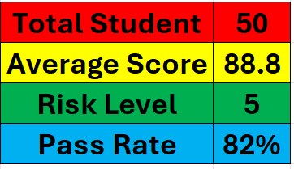
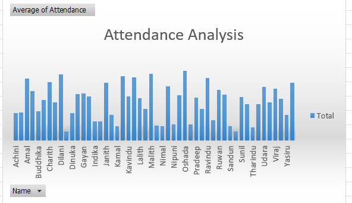
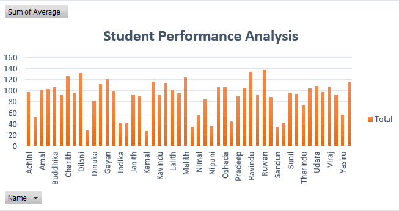
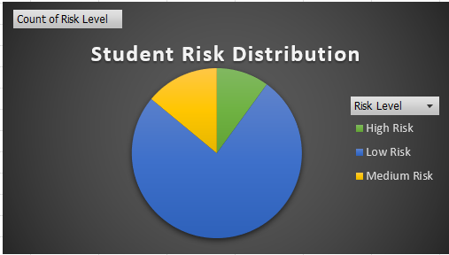
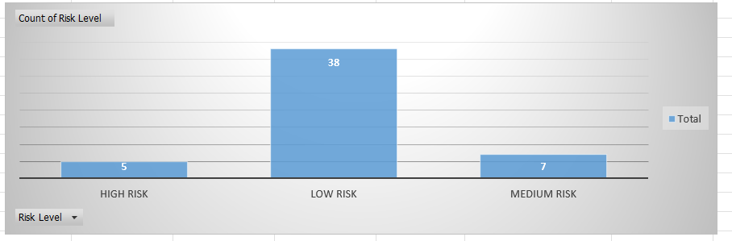

# 🎓 Student Performance Dashboard

A Power BI dashboard designed to analyze and visualize student academic performance, attendance, and risk levels. This project helps educational institutions monitor student progress through interactive dashboards and data-driven insights.

---

## 📌 Project Overview

The **Student Performance Dashboard** provides a comprehensive view of student performance using Power BI. It enables educators and administrators to identify at-risk students, monitor attendance trends, and evaluate overall academic performance through interactive visualizations.

---

## 🎯 Objectives

- Monitor student academic performance.
- Analyze attendance patterns.
- Identify students at risk of poor academic performance.
- Support data-driven decision making for educators.
- Provide interactive reports for better performance tracking.

---

## ✨ Features

- 📊 KPI Dashboard
- 👨‍🎓 Student Performance Analysis
- 📈 Attendance Analysis
- ⚠️ Student Risk Analysis
- 📉 Risk Level Distribution
- 📋 Interactive Filters & Slicers
- 📊 Dynamic Charts and Visualizations

---

## 🛠️ Tools & Technologies

- **Power BI**
- **Microsoft Excel**
- **Data Visualization**
- **Business Intelligence**
- **Data Analysis**

---

## 📂 Project Structure

```
Student-Performance-Dashboard/
│
├── dashboard/
├── data/
│   └── student_data.xlsx
├── documentation/
├── screenshots/
│   ├── KPI_Dashboard.PNG
│   ├── Attendance_Analysis.PNG
│   ├── Student_performance_Analysis.PNG
│   ├── Student_Risk_Distribution.PNG
│   ├── Risk_Level.PNG
│   └── Student_performance_dashboard_overview.PNG
└── README.md
```

---

## 📸 Dashboard Preview

### Dashboard Overview

> Add this image after uploading to GitHub:

```markdown

```

### KPI Dashboard

```markdown

```

### Attendance Analysis

```markdown

```

### Student Performance Analysis

```markdown

```

### Student Risk Distribution

```markdown

```

### Risk Level Analysis

```markdown

```

---

## 📊 Key Insights

- Identifies students requiring academic support.
- Tracks attendance trends across students.
- Visualizes overall academic performance.
- Supports early intervention through risk analysis.
- Provides actionable insights using interactive dashboards.

---

## 🚀 Future Improvements

- Connect to a live database.
- Add predictive analytics for student performance.
- Include semester comparison dashboards.
- Develop automated data refresh pipelines.

---

## 👩‍💻 Author

**Sathsarani Ranasingha**

- Aspiring Business Analyst
- Project Management Enthusiast
- Data Analytics & Power BI Learner

---

## ⭐ If you found this project useful, consider giving it a star!
